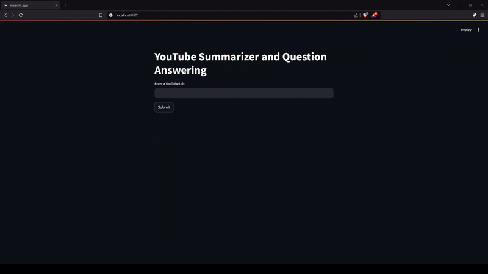

# YouTube Summarizer and Question Answering App

This Streamlit application allows users to input a YouTube video URL, summarize the video's transcript, generate Frequently Asked Questions (FAQs), and answer user-specific questions based on the video content. 

It uses Google Generative AI and the YouTube Transcript API to provide summaries, FAQs, and contextual question-answering, with translation support for various languages.

## Demo



## Features

1. **Video Transcript Extraction**: Extracts and translates the transcript of a YouTube video.
2. **Detailed Summary**: Summarizes the video transcript in a point format.
3. **FAQ Generation**: Generates a list of FAQs related to the video content.
4. **Question Answering**: Answers specific user questions based on the video transcript.
5. **Language Translation**: Supports transcript extraction in multiple languages and translates them to English.

## Prerequisites

- Python 3.8 or higher
- A Google API key for the Generative AI model.
- A `.env` file containing the Google API key in the following format:
    ```plaintext
    google_api=<your_google_api_key>
    ```

## Installation

1. **Clone the repository**:
    ```bash
    git clone <repository_url>
    cd <repository_name>
    ```

2. **Create a virtual environment** (optional but recommended):
    ```bash
    python -m venv venv
    source venv/bin/activate  # For MacOS/Linux
    venv\Scripts\activate     # For Windows
    ```

3. **Install dependencies**:
    ```bash
    pip install -r requirements.txt
    ```

4. **Set up API keys**:
    - Create a `.env` file in the project root and add your Google API key as shown above.

## Usage

1. **Run the Streamlit app**:
    ```bash
    streamlit run app.py
    ```

2. **Using the App**:
    - **Enter YouTube URL**: Paste the YouTube video URL in the input box and click "Submit."
    - **View Summary and FAQs**: After submission, a detailed summary and FAQs based on the video content will appear.
    - **Ask Questions**: Use the "Ask a Question" section to enter a question based on the video content, and receive a contextual answer.

## Code Explanation

### Main Components

- **`extract_video_id(url)`**: Extracts the video ID from a YouTube URL.
- **`fetch_and_translate_transcript(video_id)`**: Retrieves and translates the transcript.
- **`summarize_text(transcript_paragraph)`**: Summarizes the transcript content.
- **`generate_faq(transcript_paragraph)`**: Generates FAQs based on the transcript.
- **`question_text(transcript_paragraph, question)`**: Answers specific questions based on the transcript.
- **`initialize_chatbot_context(transcript_paragraph)`**: Initializes chatbot context for QA.
- **`qa_chatbot(conversation_history, user_question)`**: Continues the conversation with the user for QA.

### Supported Languages

The application supports transcript extraction and translation from several languages, including English, Japanese, Spanish, French, German, Chinese, Korean, Russian, Portuguese, Italian, and more.

## Dependencies

- **Streamlit**: For building the web interface.
- **google-generativeai**: To access Google's Generative AI models for content generation.
- **youtube-transcript-api**: For fetching transcripts from YouTube videos.
- **dotenv**: For securely managing API keys.

## Project Structure

```plaintext
.
├── assets
│   ├── demo.gif
├── notebook
│   └── yt_summarizer_QA.ipynb
├── src
│   ├── __init__.py
│   └── yt_summarizer_qa.py     # Core functions for summarizing and answering questions
├── __init__.py
├── app.py                      # Main Streamlit application
├── requirements.txt            # Python dependencies
├── .env                        # Environment file for API keys
└── README.md                   # Project documentation
```

## Contributing

Contributions are welcome! Please submit a pull request or open an issue to discuss changes.

## License

This project is licensed under the MIT License. See the [LICENSE](LICENSE) file for details.
